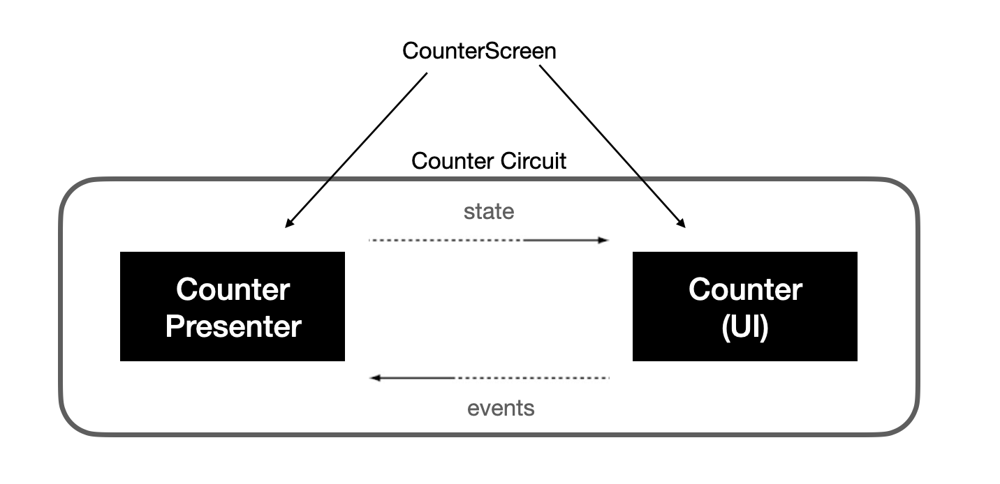

# Circuit

Compose Runtimeによる状態管理をサポートし、よりシンプルな状態管理を提供するライブラリ

* ViewModelの代わりに`Presenter`を介して`UI`に状態と副作用を渡す



```kt
@Parcelize
data object CounterScreen : Screen {
  data class CounterState(
    val count: Int,
    val eventSink: (CounterEvent) -> Unit,
  ) : CircuitUiState
  sealed interface CounterEvent : CircuitUiEvent {
    data object Increment : CounterEvent
    data object Decrement : CounterEvent
  }
}

@CircuitInject(CounterScreen::class, AppScope::class)
@Composable
fun CounterPresenter(): CounterState {
  var count by rememberSaveable { mutableStateOf(0) }

  return CounterState(count) { event ->
    when (event) {
      CounterEvent.Increment -> count++
      CounterEvent.Decrement -> count--
    }
  }
}

@CircuitInject(CounterScreen::class, AppScope::class)
@Composable
fun Counter(state: CounterState) {
  Box(Modifier.fillMaxSize()) {
    Column(Modifier.align(Alignment.Center)) {
      Text(
        modifier = Modifier.align(CenterHorizontally),
        text = "Count: ${state.count}",
        style = MaterialTheme.typography.displayLarge
      )
      Spacer(modifier = Modifier.height(16.dp))
      Button(
        modifier = Modifier.align(CenterHorizontally),
        onClick = { state.eventSink(CounterEvent.Increment) }
      ) { Icon(rememberVectorPainter(Icons.Filled.Add), "Increment") }
      Button(
        modifier = Modifier.align(CenterHorizontally),
        onClick = { state.eventSink(CounterEvent.Decrement) }
      ) { Icon(rememberVectorPainter(Icons.Filled.Remove), "Decrement") }
    }
  }
}
```

**参考**
* [Tutorial](https://slackhq.github.io/circuit/tutorial/)

